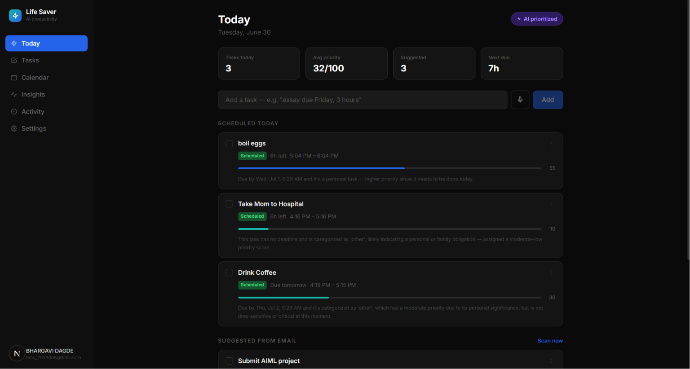
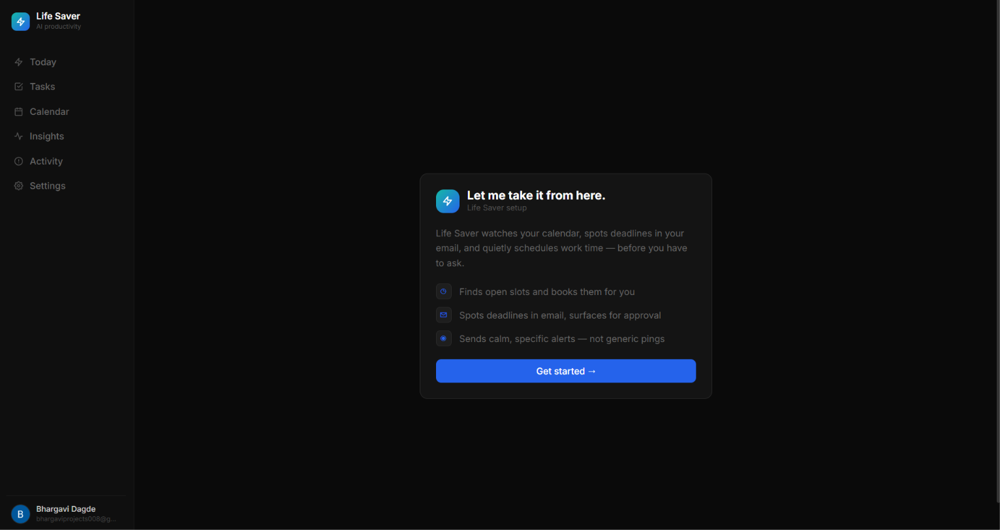
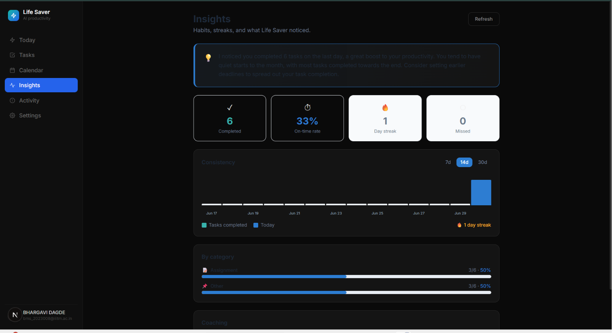

<div align="center">


</div>

---

# ⚡ Last-Minute Life Saver

> **Your AI companion that acts before you have to ask.**

Most productivity apps remind you. Life Saver **acts**. It watches your calendar, reads your email for hidden deadlines, finds time for your tasks automatically, and — when something is about to slip — quietly reschedules it and tells you exactly what changed and why. No nagging. No generic pings. Just calm, competent execution.

**→ Live demo:** [https://lifesaver-501004.web.app](https://lifesaver-501004.web.app)

---

## 📸 Screenshots

### Sign In


*Clean, minimal login. Calendar and Gmail access is explained plainly — what you get, not what permission scope is being requested.*

### Dashboard — Today's Priorities


*Every task is scored, scheduled, and reasoned. The AI priority bar shows exactly how urgent and important each task is. Email-detected tasks surface for one-tap approval.*

### Onboarding


*Life Saver sets itself up. Two clicks to connect your calendar and email, one screen to set work hours.*

### Insights — Habit Tracking


*Consistency chart, streak tracking, category breakdown, and AI-generated coaching — pattern-noticing, not failure scoring.*

---

## 🧠 How it thinks

Life Saver runs five specialized AI agents, each with a distinct job:

```
You type "essay due Friday, 3 hours"
         ↓
  Intake Agent       → parses title, deadline, category, estimated effort
         ↓
  Prioritizer Agent  → scores urgency × importance × effort → 0–100 with reasoning
         ↓
  Scheduler Agent    → checks your calendar, finds a free slot, books it
         ↓
  Your calendar has a block. Your dashboard shows the task. You didn't have to think.

Meanwhile, every 20 minutes:
  Monitor Agent      → scans all tasks, reschedules at-risk ones, sends you a push notification
  
On demand:
  Insights Agent     → aggregates your patterns, generates a coaching recap
```

The agents don't run in isolation — they share session state through a sequential pipeline built with **Google's Agent Development Kit (ADK)**. Each agent's output becomes the next agent's input.

---

## ✨ Key capabilities

**Intelligent task prioritization**
Every task gets a 0–100 priority score combining deadline urgency (deterministic) with AI-assessed importance and effort. A job interview scores higher than a routine bill at the same deadline — and the app tells you why in plain English.

**AI-powered scheduling**
The Scheduler Agent queries your Google Calendar for free slots, respects your work hours, and books time blocks automatically. Closer deadlines get earlier slots.

**Autonomous task rescue**
The Monitor Agent runs every 20 minutes without any user interaction. When a task is at risk — deadline within 4 hours, or a scheduled block already passed — it finds a new slot, moves the calendar event, and sends you a calm push notification explaining exactly what it did.

**Email-based deadline detection**
Life Saver scans your Gmail (read-only) for emails containing deadline signals. Detected tasks appear in a pending approval queue — you tap "Schedule this" and the full pipeline runs. Nothing is scheduled without your approval.

**Habit and consistency tracking**
The Insights page shows your completion streak, on-time rate, daily consistency chart (7/14/30-day views), and category-level breakdown. Coaching suggestions are pattern-based, never a failure scorecard.

**Activity feed**
Every agent action is logged with plain-language reasoning. The `/activity` feed shows exactly what happened, which agent did it, and why — in real time via Firestore listeners.

**Context-aware notifications**
Push notifications are written by the AI specifically for each task. "Your lab report is due in 3 hours — moved your 2pm block earlier, you're all set." Not "Task deadline approaching."

---

## 🛠 Built with Google technologies

| Technology | Role |
|---|---|
| **Google Agent Development Kit (ADK)** | Multi-agent orchestration — SequentialAgent pipeline + per-agent tool use |
| **Firebase Authentication** | Google sign-in, session management |
| **Cloud Firestore** | Real-time task and activity data with `onSnapshot` listeners |
| **Firebase Cloud Messaging** | Push notifications from the Monitor Agent |
| **Firebase App Hosting** | Next.js frontend deployment |
| **Google Calendar API v3** | Reading free/busy slots, creating and updating calendar events |
| **Gmail API (readonly)** | Scanning inbox for deadline signals |
| **Gemini AI** | LLM backbone for all five agents |

---

## 🏗 Architecture

```
                        ┌─────────────────────────────────────────┐
                        │           Five ADK Agents               │
                        │                                         │
  User input ──────────▶│  Intake → Prioritizer → Scheduler       │──▶ Google Calendar
  Gmail inbox ─────────▶│                                         │
  Cron (every 20min) ──▶│  Monitor (autonomous, no user needed)   │──▶ FCM push
                        │  Insights (on-demand)                   │
                        └───────────────────────────────────────── ┘
                                         │
                              FastAPI + ADK (Render)
                                         │
                              ┌──────────┴──────────┐
                         Firestore             Firebase Auth
                    (real-time listeners)    (Google sign-in)
                                         │
                              Next.js (Firebase App Hosting)
```

**New task flow:** User types → Intake parses → Prioritizer scores → Scheduler books calendar slot → Firestore writes → UI updates live

**Monitor flow:** Cron hits `/internal/monitor-sweep` → loops all users → flags at-risk tasks → LLM writes notification → reschedules calendar → FCM push → Firestore update → UI updates live

---

## 🚀 Getting started

### Prerequisites
- Node.js 20+, Python 3.12+
- Google Cloud project with Firestore, Calendar API, Gmail API enabled
- Firebase project with Auth and Firestore
- Groq API key (free at [console.groq.com](https://console.groq.com))

### Local setup

```bash
git clone https://github.com/BhargaviDagde/lifesaver
cd lifesaver

# Backend
cd backend
python -m venv .venv && .venv/Scripts/activate
pip install -r requirements.txt
cp ../.env.example .env   # fill in your values
uvicorn main:app --reload --port 8080

# Frontend (new terminal)
cd frontend
npm install
cp ../.env.example .env.local   # fill in Firebase config + backend URL
npm run dev
```

Visit `http://localhost:3000`.

### Environment variables

See `.env.example` for the full list. Key ones:

```
GROQ_API_KEY=          # free at console.groq.com
GOOGLE_CLOUD_PROJECT=  # your Firebase project ID
FIREBASE_SERVICE_ACCOUNT_B64=  # base64-encoded service account JSON
GOOGLE_OAUTH_CLIENT_ID=        # for Calendar + Gmail offline access
TOKEN_ENCRYPTION_KEY=          # fernet key for refresh token encryption
```

---

## 📁 Project structure

```
lifesaver/
├── frontend/          Next.js 15, TypeScript, Tailwind — Firebase App Hosting
│   ├── app/           Pages: dashboard, tasks, calendar, insights, activity, settings
│   ├── components/    TaskCard and other UI components
│   └── lib/           Firebase client, API wrapper, task helpers
├── backend/           FastAPI + Google ADK — Render (Docker)
│   ├── agents/        intake, prioritizer, scheduler, monitor, insights + orchestrator
│   ├── tools/         calendar_tools, gmail_tools, fcm_tools, firestore_tools
│   ├── routes/        tasks, auth, internal (cron), calendar, insights, notifications
│   └── services/      firestore_client, token_store, auth_middleware
├── scripts/           seed_demo_data.py, deploy.sh
└── firestore.rules    Security rules — oauth_tokens denied to all client reads
```

---

## 🔒 Security notes

- OAuth refresh tokens are **AES-encrypted** (Fernet) before storage — raw tokens never hit Firestore
- `users/{uid}/oauth_tokens` is **denied to all client reads** by Firestore security rules — backend only via Admin SDK
- Cron endpoint (`/internal/monitor-sweep`) is protected by a shared secret header — not an open POST
- Firebase ID tokens verified on every authenticated backend request

---

## 🗺 What's next

- Split user-facing and cron-triggered services into separate deployments for latency isolation
- Voice input via Gemini Live API bidi-streaming (architecture already scaffolded in `routes/voice.py`)
- Smarter email parsing with few-shot examples for specific institution formats
- Google Tasks and Google Meet integration for meeting prep reminders
