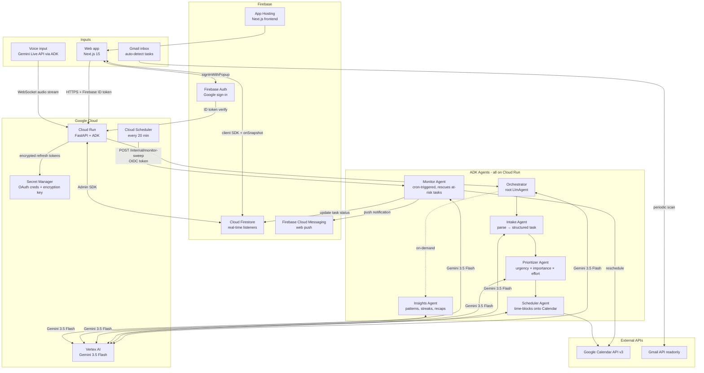

# Architecture — Last-Minute Life Saver

This document reflects what was actually built. See SPEC.md for the original design intent.

## System diagram



## Key design decisions

### Two separate auth flows
Firebase Auth (`signInWithPopup`) handles session/identity. A separate OAuth 2.0 authorization-code flow with `access_type=offline&prompt=consent` handles Calendar/Gmail background access. Refresh tokens are encrypted (Fernet/AES) before storage. Firestore security rules deny all client reads of the `oauth_tokens` subcollection.

### Sequential pipeline for new tasks
Intake → Prioritizer → Scheduler runs as an ADK `SequentialAgent`. Each step writes to shared session state; the next step reads it. This is the "show, don't tell" piece for Agentic Depth: a real workflow graph, not a single mega-prompt.

### Monitor Agent as an independent scheduled agent
The Monitor Agent is not part of the conversational agent tree. It's triggered directly by Cloud Scheduler via OIDC-authenticated POST. It loops across all users, checks at-risk conditions, sends FCM pushes, and reschedules calendar events — with zero human interaction per cycle.

### Frontend → Firestore directly for simple CRUD
Listing tasks, marking done, deleting — these go directly from the Next.js client to Firestore via the client SDK with `onSnapshot` real-time listeners. This means when the Monitor Agent reschedules something in the background, the UI updates live without a page refresh.

### Voice proxied through backend
The frontend doesn't connect directly to Google's Live API. Audio streams via WebSocket to the Cloud Run backend, which uses ADK bidi-streaming (`LiveRequestQueue`, `Runner.run_live()`) to relay to Gemini Live API. This means voice gets task creation, prioritization, and scheduling for free — same agent tree, not a reimplementation.

## Data flow — new task (happy path)

```
User types "essay due Friday, 3 hours"
  → POST /tasks (Firebase ID token)
  → auth_middleware verifies token → uid
  → orchestrator.run_new_task_pipeline(uid, text)
  → SequentialAgent: Intake Agent
      → Gemini: parse text → {title, deadline, estimatedMinutes, category}
      → write to session state
  → SequentialAgent: Prioritizer Agent
      → compute urgency (deterministic: hours remaining)
      → Gemini: assess importance/effort
      → combined score + 1-2 sentence reasoning
      → write to session state
  → SequentialAgent: Scheduler Agent
      → list_busy_blocks() → Calendar freebusy
      → find open slot within work hours, before deadline
      → create_calendar_event() → event_id
      → write task to Firestore (status: "scheduled")
      → write activity_log entry
  → Firestore onSnapshot fires on frontend
  → Task appears in dashboard + Activity feed updates
```

## Data flow — Monitor Agent sweep

```
Cloud Scheduler → POST /internal/monitor-sweep
  → verify_cloud_scheduler_token() (OIDC)
  → run_monitor_sweep()
  → for each user with googleCalendarConnected=true:
      → list tasks where status not in {done, dismissed, missed}
      → for each task: is_at_risk(task, now)?
          → deadline within 4 hours and not done: YES
          → scheduled block passed without progress: YES
      → for each at-risk task:
          → Gemini: generate specific, calm push copy
          → send_task_notification() → FCM
          → find new calendar slot (if applicable)
          → update_calendar_event() / create_calendar_event()
          → update task status → "at_risk"
          → log_agent_action(agent="monitor", action=..., reasoning=...)
  → Firestore onSnapshot fires on all active frontend sessions
  → Activity feed + task list update live
```
